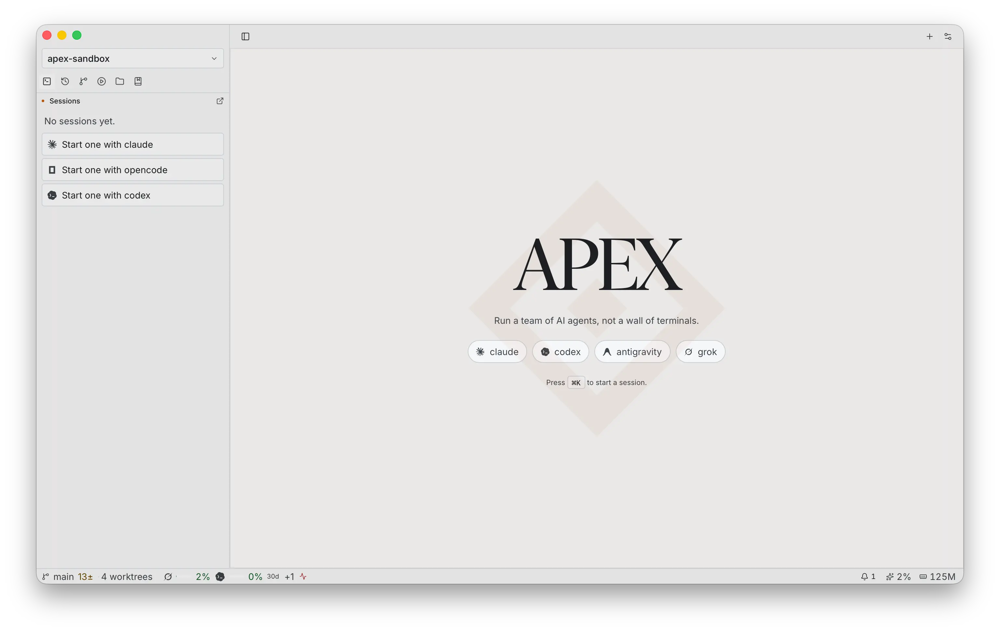
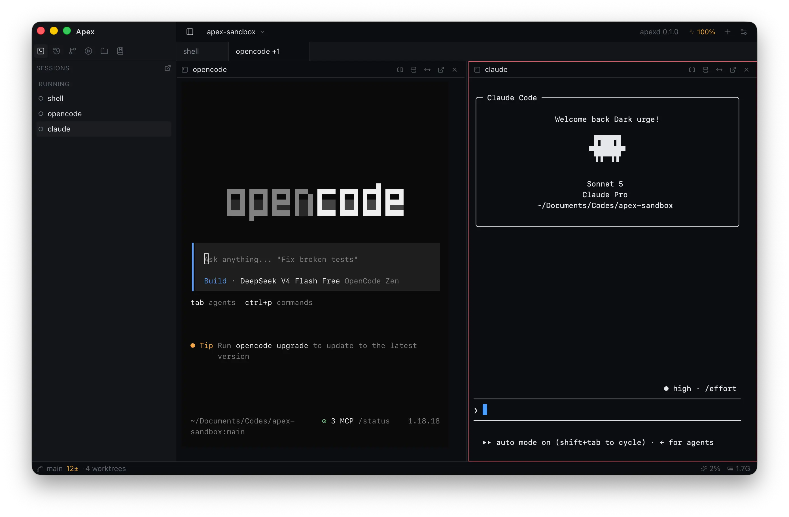

<h1 align="center">Apex</h1>

<p align="center">
  
</p>

<p align="center">
  <strong>A workspace for coding agents.</strong>
</p>

<p align="center">
  Each session is a real PTY with a profile.<br />
  Apex reads state, keeps work alive in a daemon,<br />
  and lets agents share context with each other.
</p>

<p align="center">
  <a href="https://github.com/sthbryan/apex/releases">Download</a>
  ·
  <a href="#get-it">Install</a>
</p>

---

Apex runs the CLIs you already have. It does not replace them, wrap their models, or pick a vendor. A profile says how to launch a session, how to resume it, which output means blocked, which means done, and where quota lives. The window shows that. You do not have to hunt through terminals to find it.

Sessions belong to `apexd`. Close the app, the agents keep going. Open it again and you are back on the same PTYs, including each agent's own resume path.

---

## Screenshots

|  |  |
| :--: | :--: |
| **Workspace:** every agent pane side by side | **Sessions:** state that survives a restart |

---

## What it actually does

**Reads state, does not just render bytes**  
Per-agent patterns mark a session *blocked*, *working*, or *done*. Notifications when one needs you, instead of a stalled prompt sitting in a pane you stopped looking at.

**Quota before you hit the wall**  
Usage windows per agent, cached and polled, so you know what is left before a session stops mid-task.

**Agents that talk to each other**  
Apex exposes an MCP server to every session: shared project context they can read and write, sessions they can spawn, transcripts they can inspect. One agent finds something, the others have it. A spawned agent can stand down without taking the session with it.

**Worktrees, not crossed wires**  
Each session can run in its own git worktree. Parallel agents on the same repo stop overwriting each other's work.

**A daemon owns the sessions**  
`apexd` holds every process. Close the window, reopen it, resume where the agent was, including its native resume flag when the profile defines one.

**Bring your own CLI**  
Any agent CLI, or a plain shell. Each is a TOML file; adding the next one is writing another. Bundled profiles live in `agents/`.

---

## Built for

- Anyone running more than one agent and losing track of them
- Work that is worth parallelizing across agents on the same repo
- People who want agents sharing findings instead of rediscovering them

---

## Get it

**macOS / Linux: one-liner**

```bash
curl -fsSL https://raw.githubusercontent.com/sthbryan/apex/main/install.sh | bash
```

| | |
|---|---|
| **Install script** | One-liner above (macOS Apple Silicon · Linux x86_64) |
| **Download** | [GitHub Releases](https://github.com/sthbryan/apex/releases) |
| **From source** | `cargo run -p apexd`, then `bun run tauri dev` in `apps/desktop` |

Apex drives the CLIs you already have installed, through a real PTY. Your agents behave as they do in a terminal. Apex watches.

---

## Architecture

- `crates/apex-proto`: command and event protocol over a transport trait.
- `crates/apex-core`: projects, sessions, agent profiles, and the SQLite store.
- `crates/apex-pty`: PTY processes, output ring buffers, state detection.
- `crates/apex-mcp`: the MCP surface agents use to reach Apex and each other.
- `crates/apexd`: daemon that owns every session and outlives the UI.
- `apps/desktop`: Tauri v2 client.

The daemon owns all state. The app is a thin client that attaches over a Unix socket.

---

<p align="center">
  <sub>MIT License</sub>
</p>
